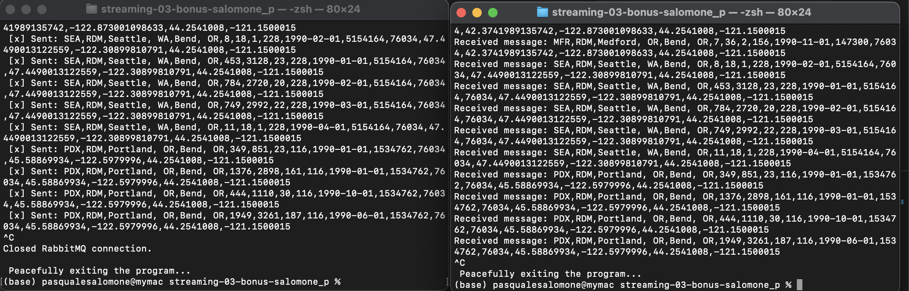

# Project Title: streaming-03-bonus-salomone_p
## Introduction:
This project involves the creation of a producer that reads data from an Airport CSV file and sends messages to a new queue at intervals of 1-3 seconds. Simultaneously, a consumer is implemented to read these messages from the queue and write them to a new file as they are received.

In a fictional scenario, a company named 'Alpha' represents a consumer that acquires airport data by reading the messages produced by the aforementioned process. These messages contain relevant information from the Airport CSV file, and 'Alpha' can process this data for their specific needs.

-The `producer_salomone.py` program overall demonstrates how to establish a connection with RabbitMQ, send messages to a queue,handle interrupts gracefully or peacefully whichever definition sounds best, and manage RabbitMQ connections effectively.

-The `consumer_salomone.py` program overall demonstrates how to establish a RabbitMQ connection, set up a consumer to process messages from a queue, handle interrupts gracefully or peacefully whichever definition sounds best, and effectively manage RabbitMQ connections and message processing.

#### Source Data: https://www.kaggle.com/datasets/flashgordon/usa-airport-dataset
#### Author: Pasquale Salomone, 28 August 2023

## Prerequisites

1. Git
1. Python 3.7+ (3.11+ preferred)
1. VS Code Editor
1. VS Code Extension: Python (by Microsoft)

The following modules are required: 

| Module          | Version  |
|-----------------|----------|
| csv             | 1.0      |
| random          | 3.11.4   |
| signal          | 3.11.4   |
| sys             | 3.11.4   |
| time            | 3.11.4   |
| pika            | 1.3.2    |

## Multiple Terminals

## Additional Resources

1. For more information about Git in VS Code, see [Using Git source control in VS Code](https://code.visualstudio.com/docs/sourcecontrol/overview).
1. For more information about editing Markdown in VS Code, see [Markdown and Visual Studio Code](https://code.visualstudio.com/docs/languages/markdown).

## Acknowledgments

I would like to acknoledge both Stackoverflow and ChatGPT as an instrumental aid in the development of this project.